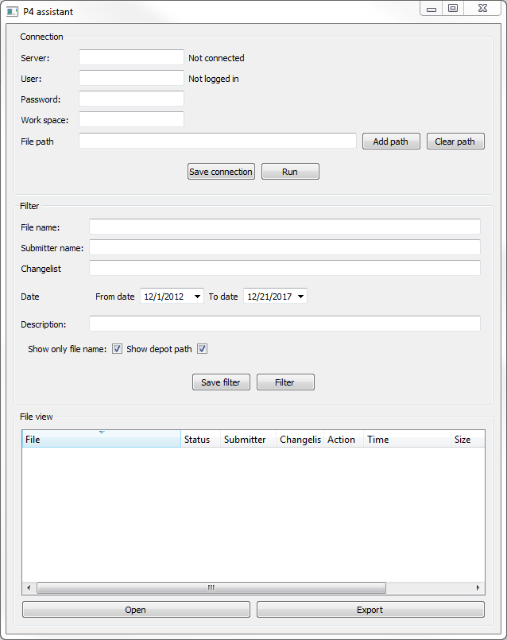
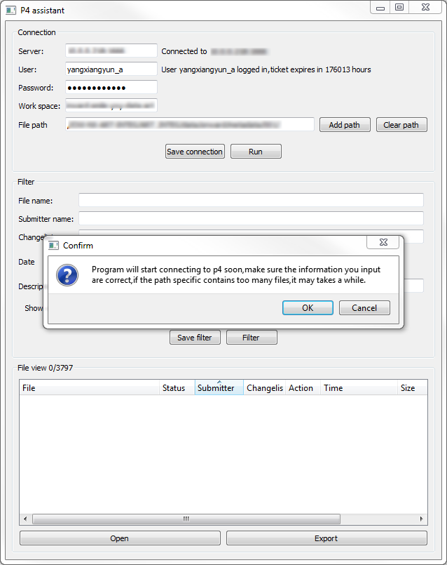
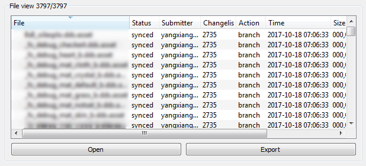
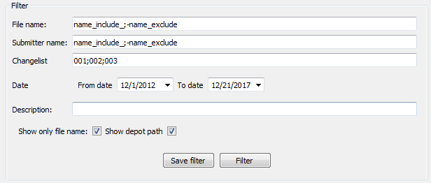
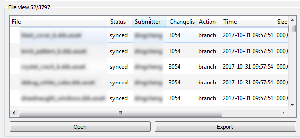
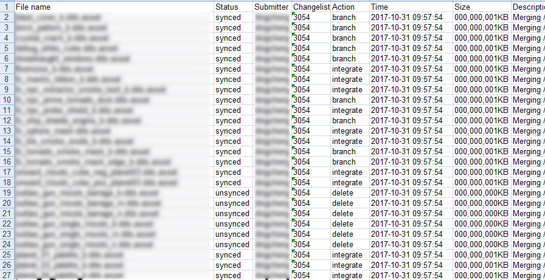

# P4-Assistant
Standalone application based on python and pyqt,for quering informations from perforce server,just like "Find files" in p4v,but with more controls and can export as xls file.

# usage  
Main ui:  
   

Input connection information,if you are not querying informations specific to user or workspace then you only need to type in server port.  
copy paste perforce depot path or select your local workspace path,multiple paths can be seperated by ";".  
Press "save connection" will save current connection information to text file and program will read this file next time you lauch.  
  

After pressing "run" button,the results will show in the bottom section,you can sort them by clicking on the any colum titile.  
   

In the filter section,youcan aplly filter setting,add "-" before keyword for exclude filter,use ";" to seperate multiple keywords,filter will be applied in order.filter can also be saved  
   

Filter results:  
   

You can export the result to xls file and edit them in excel for more advanced control,you can also load in a existing one.
   
